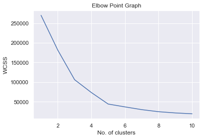
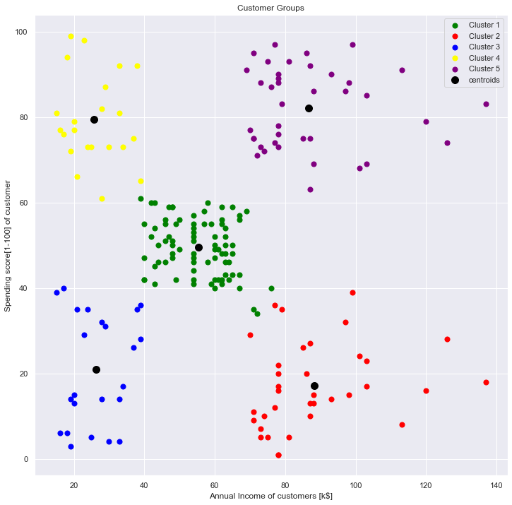

# DS-Project-4_Customer_Segmentation_KMeansClustering
#### Problem Statement  
You want to understand the customer's spending behaviour and group them so that, more critical insights can be given to the marketing team which will help them plan strategies accordingly.

* I approached this problem statement by designing a model that uses certain customer data to group them accordingly.
* Dataset - Fetched the data from the Kaggle resource which I have linked below. The Dataset includes various features/information about the customers.
* Model - The major aim in this project is to group the customers based on their spending pattern using the K-Means clustering algorithm. 

## Code and Resources Used ##
**Python Version:** 3.10.5  
**Packages:** pandas, numpy, sklearn, matplotlib, seaborn  
**For Web Framework Requirements:** _pip install -r requirements.txt_  
**Data Resources:** <https://www.kaggle.com/datasets/vjchoudhary7/customer-segmentation-tutorial-in-python>

## About the Dataset ##
The dataset consists of basic customer information such as:
1. **Customer ID**  
2. **age**  
3. **gender**  
4. **annual income** - This is scaled in per K$ (k=1000)  
5. **spending score** - This refers to the amount of money spent by the customer.  Scored in the scale of [1-100]  

This Dataset was collected through membership programmes.  
After Basic data and statistical analysis , I find only the **annual income** and **spending score** information important when it comes to this particular problem statement.  
Therefore, I drop all other coloumns of data.  
[Note: You can keep the ones according to your preferences.]

## Choosing the Optimum number of clusters by calculating WCSS ##
The optimum number of clusters (clusters refers to the groups) is unknown to us just by looking at the data.  
We can choose the ideal number of clusters by calculating the WCSS --> Within Clusters Sum of Squares  
By calculating the WCSS, we can find the distance between each datapoint from the centroid of the cluster.

To choose the ideal number of clusters, I have to visualize the clusters on the **Elbow Point Graph** which helps us determine the ideal cluster.  
The ideal cluster is the one after which there are no significant drops in the elbow point graph.  
According to our dataset it is **5** as we can see below :

Therefore, the optimum number of clusters for this dataset is **5**.

## Training the model with the optimum number of clusters ##
The model is defined by the KMeans algorithm with the arguments as follows:  
* n_clusters - 5 (This is the number of clusters)  
* init - For the initialization method, i go with **k-means++** as it is the most ideal for K-means Clustering.  
* random_state - can be any number according to your pref. This maintains the randomness state of the dataset.  

#### Returning labels for each cluster ####
Now I use the model.fit_predict() function on the data which returns a cluster number for each datapoint in the dataset.  
Basically, it tells us that to which specific cluster does the datapoint belong to.

## Data visualizing of all the clusters ##
Finally , we use the matplotlib to plot a scatter graph for all the clusters and centroids.  
As for the x_co-ordinate of the graph, It refers to the Annual income of the customers in k$  
As for the y_co-ordinate of the graph, It refers to the spending score [1-100]  

This helps us a create a beautiful visualization of the clusters. This makes it easier to create bussiness insights and strategies by reading into customer behaviour.

#### From this amazing visualization we can make some bussiness insights and assist the market strategists. ####
#### One example could be that as we can see the spending pattern of these groups of customers according to their annual income, the bussiness can come up with logical offers/membership cards for each group. ####
